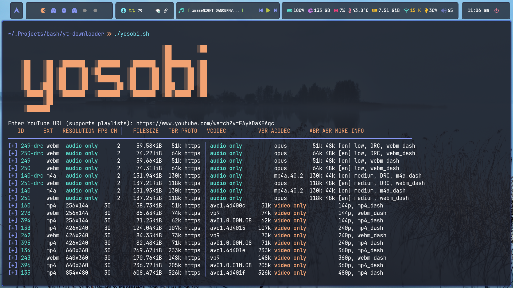
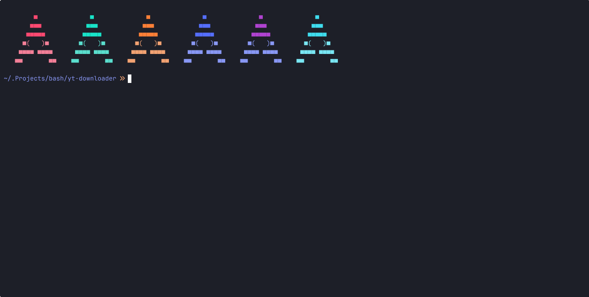

# Yosobi - YouTube Downloader Script


__`Yosobi`__ is a **Bash script** to download YouTube videos & playlists with **audio extraction**, **video merging**, **thumbnail embedding**, and **smart filename sanitization**. Choose formats interactively or predefine them, set output directories, and retry downloads automatically.  

---

## 🚀 Features

- 📹 Download **videos** or **playlists**  
- 🎵 Extract audio to **MP3** with **thumbnail**  
- 🎬 Merge **video + audio** into MP4  
- 🔄 Automatic **retry** for failed downloads  
- 🗂️ **Custom output directories**  
- 📝 Logs **download history**  
- ✨ Interactive or preset **format selection**  



---

## ⚙️ Dependencies

- `yt-dlp`  
- `ffmpeg`  
- `perl`  
- `jq`  

> 💡 Install via your package manager or `pip` for `yt-dlp`.

---

## 🛠️ Installation

Clone and enter the repo:

```bash
git clone https://github.com/VexilonHacker/yosobi.git
cd yosobi
```

Make it executable:

```bash
chmod +x yosobi.sh
```

Optional: add to PATH:

```bash
sudo ln -s $(pwd)/yosobi.sh /usr/local/bin/yosobi
```

---

## 📝 Help menu
```bash

                                                ░██        ░██
                                                ░██
    ░██    ░██  ░███████   ░███████   ░███████  ░████████  ░██
    ░██    ░██ ░██    ░██ ░██        ░██    ░██ ░██    ░██ ░██
    ░██    ░██ ░██    ░██  ░███████  ░██    ░██ ░██    ░██ ░██
    ░██   ░███ ░██    ░██        ░██ ░██    ░██ ░███   ░██ ░██
     ░█████░██  ░███████   ░███████   ░███████  ░██░█████  ░██
           ░██
     ░███████

Options:
  -u, --url          YouTube URL (video or playlist)
  -f, --format       Preselected format code (e.g. 247, 251)
  -d, --dir          Override base output directory (Videos/Music)
  -o, --output       Custom output file name (no extension)
  -m, --max-retries  Set maximum retries for format fetching/download (default: 3)
  -h, --help         Show this help menu

Examples:
  ./yosobi -u 'https://youtu.be/FAyKDaXEAgc'
  ./yosobi --url 'https://youtu.be/FAyKDaXEAgc' --format 247 --max-retries 5
  ./yosobi -u 'https://youtube.com/playlist?list=...' --format 251 --dir ~/Downloads
```

---

## 🎵 Playlist Handling

Choose per playlist:

1️⃣ **One format** for all videos  
2️⃣ **Format individually** per video  

---

## 💾 Output

- Audio → **MP3** with thumbnail  
- Video → **MP4** 
- Filenames **sanitized**  
- History in `~/.yosobi_hist.txt`:

```bash
Date: 2025-10-21 10:35:19
Video Name: the kid who would do *this* is in jail now.mp3
URL: https://www.youtube.com/watch?v=A2KbiwDKuw0
Type: mp3
Saved Path: /home/user/Music/the kid who would do *this* is in jail now.mp3
==========================================
```


---

## 📝 License

**[MIT License](LICENSE)**  

---


Enjoy downloading YouTube videos with **`yosobi` ;]** and **Remember to ⭐ start this project if you found it useful!**

