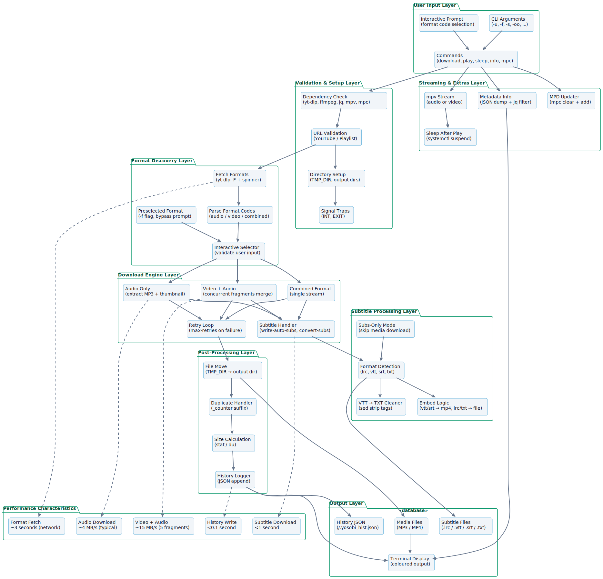
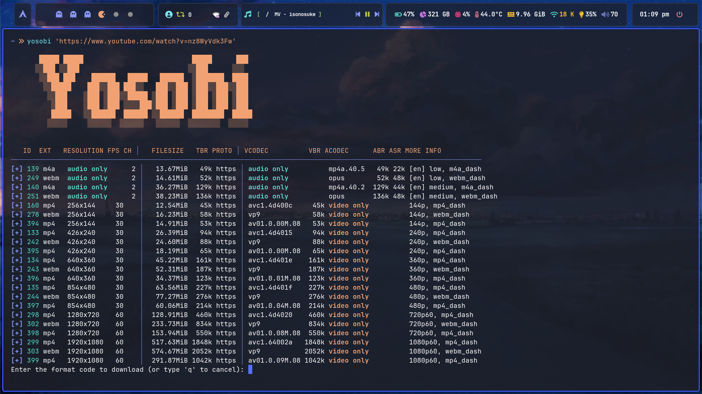

# 🎬 Yosobi – The Ultimate YouTube Downloader Script


<p align="center">
  
</p>

> **Download, stream, lyric‑sync, and manage your YouTube media. all from the terminal >;]**

---

## ✨ Features at a Glance

| Category | Features |
|----------|----------|
| 🎥 **Video** | Any quality, video+audio merge with concurrent fragments |
| 🎵 **Audio** | MP3 extraction, embedded thumbnail, metadata tags |
| 📜 **Subtitles** | VTT, SRT, LRC, clean TXT; embed or keep separate |
| 🎤 **Subs‑only** | Download subtitles without the media |
| 🧠 **Format** | Interactive or pre‑selected, automatic fallback |
| 📂 **Paths** | Exact output path (`-oo`) or directory+name (`-d`/`-o`) |
| 🖥️ **Streaming** | Play audio/video with `mpv`, optional suspend after |
| 🎚️ **MPD** | Update playlist alphabetically or newest‑first |
| 🧾 **History** | JSON log in `~/.yosobi_hist.json` |
| ℹ️ **Metadata** | Full JSON dump with `jq` filter support |
| 🔁 **Retry** | Auto‑retry on failure, configurable attempts |
| 🎨 **UI** | Spinner, coloured output, ASCII logo |

---

## 🔧 Dependencies

| Tool | Purpose | Required |
|------|---------|----------|
| `yt-dlp` | Core downloading engine | ✅ Yes |
| `ffmpeg` | Audio extraction, video merging, thumbnails | ✅ Yes |
| `jq` | Playlist detection, history, `info` command | Optional |
| `mpv` | `play` and `sleep` commands | Optional |
| `mpc` | MPD playlist update | Optional |

```bash
# paru or yay or any other package manager
sudo paru -S ffmpeg jq  mpv mpc yt-dlp  # Arch
sudo apt install ffmpeg jq  mpv mpc yt-dlp # Debian/Ubuntu
```

---

## 🚀 Quick Start

```bash
git clone https://github.com/VexilonHacker/yosobi.git
cd yosobi
chmod +x yosobi.sh

# make the tool accessible system wide
sudo ln -s $(pwd)/yosobi.sh /usr/local/bin/yosobi
```

---

## 📚 Usage

```
yosobi [command] [options] [url]
```

Run `yosobi --help` for the full option list, or `yosobi --examples` for advanced usage examples.

### 🎬 Video Downloads

```bash
yosobi -f 247 'https://www.youtube.com/watch?v=dQw4w9WgXcQ'
yosobi -f 137 -o "My Video" -c 10 'URL'
```

### 🎵 Audio + Lyrics

```bash
yosobi -s -sf lrc -f 251 'https://www.youtube.com/watch?v=kJQP7kiw5Fk'
```

### 📁 Exact Output Path

```bash
yosobi -oo '/home/user/Music/Song.mp3' -f 251 'URL'
```

### 🎤 Subtitles Only

```bash
yosobi -s -so -sf txt -o transcript 'URL'
```

### 🎧 Streaming

```bash
yosobi play 'URL'
yosobi play --video 'URL' --start=60
yosobi sleep 'URL'
```

### 🔍 Metadata

```bash
yosobi info 'URL'
yosobi info 'URL' '.title'
```

### 🎚️ MPD Integration

```bash
yosobi mpc
yosobi mpc --newest
```

---

## 📋 History

Downloads are logged in `~/.yosobi_hist.json`:

```json
[
  {
    "date": "2025-10-21 10:35:19",
    "title": "Amazing Song.mp3",
    "url": "https://www.youtube.com/watch?v=...",
    "format": "mp3",
    "path": "/home/user/Music/Amazing Song.mp3"
  }
]
```

View with `yosobi --history`, clear with `yosobi --clear-history`.

---

## 📐 Architecture



Yosobi follows a layered architecture with 8 distinct layers, from user input to final output. The diagram above illustrates the complete data flow through validation, format discovery, download engine, subtitle processing, post‑processing, and streaming components.

## 🖼️ Screenshots



### 📁 Additional Files

| File | Description |
|------|-------------|
| [`Architecture.puml`](./assts/Architecture.puml) | PlantUML source for the architecture diagram |
| [`yosobi.cast`](./assts/yosobi.cast) | Original asciinema recording (replay with `asciinema play`) |

> The `.cast` file can be replayed anytime with `asciinema play ./assts/yosobi.cast` or re‑rendered to GIF/SVG with `agg` / `svg-term`.


## 📜 License

**[MIT License](LICENSE)**

---

<div align="center">
  Made with ❤️ by <a href="https://github.com/VexilonHacker">VexilonHacker</a><br>
  ⭐ Star this project if you found it useful ->|^_^|->
</div>
